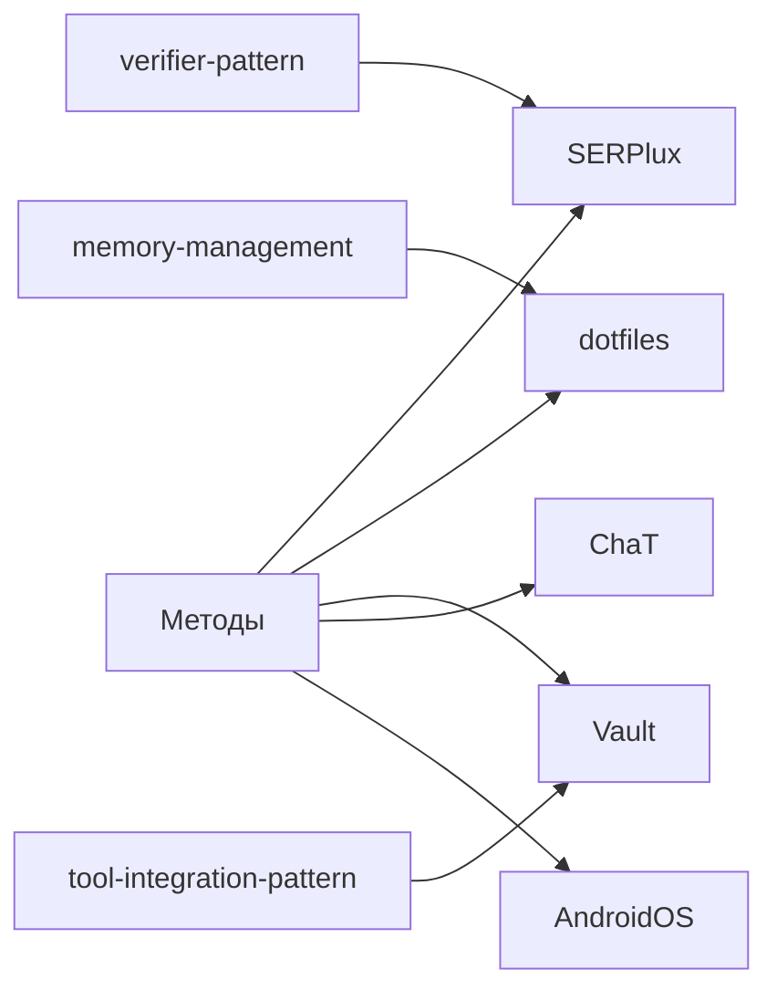
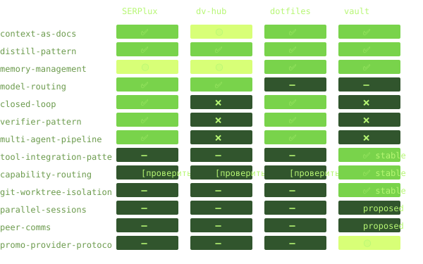
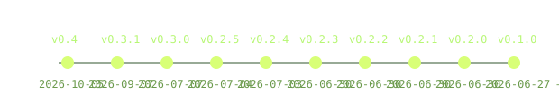
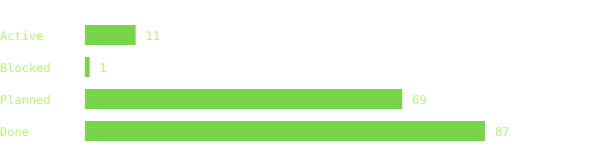

# VibeOS v0.4 — Персональная система вайбкодинга

> Это не журнал. Это концептуальный слепок того, как я кодирую и какие экосистемы и пайплайны создаю с ИИ. Своеобразный дашборд, показывает какие подходы и 
> приёмы использую, какие проекты веду и куда расту. Версионируется вместе со
> мной — эволюция подходов, инструментов и философии.

---

## Навигация

| Раздел                                                              | О чём                                                   |
| ------------------------------------------------------------------- | ------------------------------------------------------- |
| [[#Философия\|Философия]]                                           | Как я мыслю вайбкодинг, принципы, нетривиальные решения |
| [[#Сейчас кипит\|Сейчас кипит]]                                     | Активные лаборатории и evidence                   |
| [[#Изящные решения\|Изящные решения]]                               | Методология и экстремальный вайбкодинг            |
| [[#Память и эволюция графов\|Память и эволюция графов]]              | Файловая память, flush и idea-graph                |
| [[#Витрины проектов\|Витрины проектов]]                             | Человеческие входы в проекты                       |
| [[#Система\|Система]]                                               | Как устроена моя экосистема: волт, OpenCode, проекты    |
| [[#Инструменты\|Инструменты]]                                       | Внешние API как детерминированные инструменты (tools/)  |
| [[#Методы\|Методы]]                                                 | Все приёмы с реальным статусом внедрения                |
| [[#Проекты\|Проекты]]                                               | Все проекты с их стадией и стеком                       |
| [[#Инвентарь\|Инвентарь]]                                           | Агенты, команды, плагины, шаблоны, скрипты              |
| [[#Внедрено vs Готово vs В планах\|Внедрено vs Готово vs В планах]] | Что уже работает, что ждёт внедрения, что в перспективе |
| [[#Нетривиальные решения\|Нетривиальные решения]]                   | Что отличает мою систему от типовой                     |
| [[#Вектор роста\|Вектор роста]]                                     | Куда развиваюсь, какие навыки/методы осваиваю           |
| [[#Чейнджлог\|Чейнджлог]]                                           | История версий VibeOS                                   |

---

## Витринный слой

VibeOS — витрина экосистемы: один канон, два представления. Этот Markdown
предназначен для Obsidian и глубины; [HTML-витрина](docs/vibeos/index.html) —
для offline-веба и будущего GitHub Pages. Устойчивость здесь означает
**биоразнообразие**: разные проекты, роли и методы усиливают друг друга, не
сливаясь в один монолит.

### Сейчас кипит

| Лаборатория | Зачем | Статус | Evidence |
|---|---|---|---|
| **peer-comms** | Общение параллельных сессий через `opencode run -s <sessionID> -m <model>` и общее поле; `-m` обязателен для отправляющей модели | 🟡 метод proposed | [[02-Methods/peer-comms]], [[04-Memory/idea-graph/README]] |
| **idea-graph** | Из эксперимента двух сессий — в append-only поле nodes/edges/protocol с provenance | ✅ валидатор работает | [[04-Memory/idea-graph/README]], [[tools/idea-graph/validate.mjs]] |
| **decision-queue** | Дилеммы и approval-gates не теряются в разговоре | ✅ runtime slice; acceptance pending | `.mcode/skills/decision-queue/SKILL` (вне волта), `.mcode/command/decisions` (вне волта), [[control-plane/decision-queue/SCHEMA]] |
| **key-rotator** | Операционно ротировать ключи без попадания секретов в репозиторий | [проверить] | [[tools/key-rotator/README]] |
| **model-bench** | Сравнивать capability/стоимость моделей до маршрутизации | ✅ реализация, дальнейшие фиксы planned | [[tools/model-bench/README]], [[TASKS#T-146]] |
| **mcp-readonly** | Интегрировать MCP только в read-only границах | [проверить] / часть мостов frozen | [[tools/mcp-readonly/server.py]], [[TASKS#T-108]] |
| **mem-index** | Быстро находить durable facts без перечитывания волта | [проверить] | `tools/mem-index/README.md` (вне волта) |
| **noop-guard** | Эксперимент с нуджем молчаливых ходов | ❌ упразднён 2026-09-23: бесконечно перезапускал агента и жёг токены | [[TASKS#T-136]], [[03-Projects/dotfiles#Состояние]] |

### Изящные решения

| Проблема | Изящный ход | Где живёт |
|---|---|---|
| Контекст разрастается и дорожает | **replay-budget**: cap старых tool-результатов, head/tail и защита последних 40 KB | `~/.config/opencode/plugins/replay-budget.ts`, [[TASKS#T-135]] |
| Агент повторяет один tool-call | Нативный **doom-loop** детектор; авто-deny — конфигурационный гейт, не самописный watchdog | [[TASKS#T-136]], `doom_loop` |
| Вставленный текст притворяется системным | **input-security/sanitization**: экранирование transport markup и redaction секретов | `~/.config/opencode/plugins/input-security.ts`, [[TASKS#T-137]] |
| Компакция убивает знания | **session-flush**: durable summary и session-log до/во время idle | `~/.config/opencode/plugins/session-flush*`, [[02-Methods/memory-management]] |
| Повторная проверка тратит время | **verify-кэш** по tree-hash: тот же вход не проверять вслепую | `tools/verify-cache/`, [[TASKS#T-135]] |
| Параллельные сессии сталкиваются | **peer_role/peer_lease**: сигнализация ролей и владения через файл, без локов | `tools/peers/peer_role.py`, [[02-Methods/peer-comms]] |
| Планировщик не должен писать код | **plan→build через task-tool**: права доступа закрепляют разделение думать/делать | SERPlux, [[02-Methods/multi-agent-pipeline]] |
| Слои замедляют маленький продукт | **FLAT layout**: модули в корне как осознанный контракт | SERPlux, [[03-Projects/SERPlux]] |
| Несколько клиентов требуют копий приложений | **Мультиклиентность через схему БД**: clients/positions/labels, идемпотентная миграция | SERPlux, [[03-Projects/SERPlux]] |

### Память и эволюция графов

- **Три уровня файловой памяти:** `04-Memory/active-context.md` — текущий
  контекст; `facts.md` — устойчивые факты; `session-log/` — последовательность
  событий. Это разные сроки жизни, а не три копии одного текста.
- **Pre-compaction flush** сбрасывает решения и handoff до сжатия. В Vault это
  закреплено в memory-management и session-flush-плагине.
- **idea-graph** — `nodes/`, `edges/`, `protocol` в append-only JSONL; каждая
  запись несёт provenance `quoted` или `derived`. Граф переживает compact и
  handoff, потому что живёт на диске, а не в окне модели.
- **Memory over claude-mem:** файлы версионируются Git, доступны offline,
  прозрачны для аудита и не зависят от внешнего сервиса/провайдера.

### Витрины проектов

- **recruiting-hr — bootstrap-кейс.** Материалы docx→md и агентский слой уже
  заведены; операционная норма — 5 человек в неделю, целевой рывок — 20 за
  2–3 дня [проверить по первоисточнику карточки/кейса]. Метрика перехода к
  второму объекту — 10 найденных и пристроенных рабочих. [[03-Projects/recruiting-hr]]
- **ChaT — 8 агентов knowledge-operations.** Новая территория собирается
  интервью; legacy Notion остаётся референсом, а профильные записи проходят
  approval-gated governor. [[03-Projects/ChaT]]
- **AndroidOS — evolution/classifier.** Umbrella mobile/offline-first в
  planning: Personal Assistant ведёт inbox→structure, а путь к on-device
  определяется исследованием и acceptance, не декларацией. Laya vs Jev —
  [проверить: evidence в карточке не найден]. [[03-Projects/AndroidOS]]
- **M Code Desktop — майнинг-станция фич.** Изучаем внутренние органы и
  переносим ордены в TUI: replay budget, peers, verify-кэш и браузер. Это
  источник решений, а не отдельный runtime-клей. [[01-Reference/mcode-desktop]]

### Философский слой как инструкция

| Принцип | Операционный механизм |
|---|---|
| Документация — инфраструктура | Сначала canonical spec/карточка и DoD, затем build; evidence возвращается в документ |
| Метод важнее промпта | Повторяемый паттерн дистиллируется в команду; в Vault 12 команд и отдельные skills |
| Централизованное знание | Vault хранит canonical facts, проекты ссылаются через wikilinks, не копируют их |
| Агенты — инструменты | plan/build/reviewer/verifier получают разные права и named route |
| Системный инженер, не prompt-инженер | Проектировать loop и гейты: capture→classify→route→verify |
| Память — диск, а не RAM | flush-протокол + session-flush перед compaction |
| Общение ≠ авторизация | peer-comms передаёт сигнал/письмо; approval и task-dispatch остаются отдельным гейтом |

### Mermaid: три живых контура



```mermaid
flow LR
  capture[Capture] --> classify[Classify]
  classify --> route[Route named role]
  route --> verify[Verify PASS/FAIL]
```

```mermaid
flow LR
  write[peer write: opencode run -s -m] --> field[(idea-graph common field)]
  field --> read[peer read/export]
  read --> write
```

### Живой режим

Текст — карта смыслов, а [Pip-Boy host: `tools/ecosystem-map/`](tools/ecosystem-map/)
— интерактивное продолжение витрины: фильтры, зависимости, acceptance и
Kanban-проекция живого registry. Карта read-only и не заменяет этот канон.

### Чарты витрины

Перегенерация одной командой: `python3 tools/vibeos-vitrina/charts.py`.





---

## Философия

### Как я мыслю вайбкодинг

Вайбкодинг для меня — не про «бросить задачу нейросети и получить результат».
Это про **построение системы**, внутри которой ИИ делает то, что умеет лучше
человека, а человек делает то, что ИИ пока не может.

Мои принципы:

1. **Документация — это инфраструктура.** Спеки и контекст — не архивы, а
   исполняемые контракты. Они ограничивают пространство решений агента и
   задают критерии приёмки. Без них агент галлюцинирует архитектуру.

2. **Метод важнее промпта.** Одноразовый гениальный промпт проигрывает
   переиспользуемому протоколу. Дистиллируй повторяющиеся паттерны в команды.
   Строй конвейеры, не пиши инструкции.

3. **Централизованное знание.** Один источник правды (волт) по OpenCode,
   методам и проектам. Не дублировать знание в каждом репо — ссылаться.

4. **Агенты — не рабы, а инструменты.** Каждый агент имеет свою зону
   ответственности, модель и права. build пишет код, plan думает, verifier
   проверяет. Разделение ролей — не роскошь, а необходимость.

5. **Я — системный инженер, а не промпт-инженер.** Я проектирую петли,
   конвейеры и протоколы. Агенты крутятся внутри них. Моя работа — построить
   путь, по которому агент дойдёт до результата без моего участия.

6. **Память — это диск, а не RAM.** Контекстное окно — рабочая память.
   Всё важное сбрасывается в файлы до компакции. Ни одно знание не должно
   умереть со сжатием контекста.

### Нетривиальные решения в моём подходе

- **OKF v0.1 (Open Knowledge Format)** — собственная архитектура организации
  знаний: Reference → Methods → Projects → Memory → Templates. Волт — не
  свалка заметок, а Knowledge Bundle со строгой структурой.
- **Волт как командный центр** — из волта librarian управляет всеми проектами:
  мониторинг, аудит, апгрейды. Единая точка входа.
- **librarian — не dev-агент** — он не пишет код. Он управляет знаниями.
  Отдельный класс агента с `doom_loop: allow` и `external_directory: allow`.
- **sysop — операционная система как проект** — Manjaro инвентаризируется
  через OpenCode. Агент ходит по системе read-only, предлагает изменения
  текстом.
- **Jamstack-подход к вайбкодингу** — агенты собираются из готовых модулей
  (команды/скиллы/плагины) как из коробок Lego.

---

## Система

### Как устроена экосистема

```
┌─────────────────────────────────────────────────┐
│                 OpenCode Vault                  │
│  (штаб, справочник, память, пульт управления)   │
│         librarian — командный центр             │
└────────────────┬────────────────────────────────┘
                 │ аудит / апгрейды / мониторинг
    ┌────────────┼────────────┬──────────────┐
    ▼            ▼            ▼              ▼
┌───────┐  ┌────────┐  ┌──────────┐  ┌──────────┐
│SERPlux│  │ dv-hub │  │ dotfiles │  │ (новые…) │
│Python │  │ TS/Hono│  │ Manjaro  │  │          │
│SEO    │  │ comm.  │  │ sysop    │  │          │
└───────┘  └────────┘  └──────────┘  └──────────┘
```

### Стек инструментов

| Инструмент | Роль |
|-----------|------|
| OpenCode | Основной IDE-фреймворк с ИИ-агентами |
| LinaliAPI | Провайдер моделей (linaliapi/*) |
| GLM 5.3 Flash | Глобальная модель по умолчанию (`opencode-go/glm-5.3-flash` в opencode.json) |
| librarian-модель | **Основная модель librarian** — `opencode-go/gpt-5.6-luna` |
| M Code Desktop | Майнинг-станция фич (форк OpenCode, ордены портируются в TUI) |
| Obsidian | Редактор markdown для волта |
| Git + GitHub | Версионирование всего (волт + проекты) |

---

## Инструменты

### tools/ — внешние API как инструменты агентов

Директория `tools/` содержит скрипты-инструменты VibeOS. Каждый инструмент —
детерминированный мост к внешнему API: получает данные, возвращает результат
для анализа агентом. Реализация метода [[02-Methods/tool-integration-pattern|tool-integration-pattern]].

| Инструмент | Назначение | Статус |
|------------|-----------|--------|
| `tools/telegram-capture/` | Извлечение постов из группы @inbox_tools по теме, маркировка реакциями | ✅ (T-062) |
| `tools/ecosystem-map/` | Pip-Boy карта экосистемы → Kanban control plane + action-механизм | ✅ (T-069/T-121/T-129/T-140) |
| `tools/playwright-browser/` | Браузерный тул: JS-рендеринг, снапшот→element-ref, сессии | ✅ (T-134) |
| `tools/verify-cache/` | Гейты волта с tree-hash кэшем (пустые .md + викилинки) | ✅ (P6 #33) |
| `tools/peers/` | Файл-реестр ролей параллельных сессий (claim/holds/release) | ✅ (P6 #31) |
| `tools/idea-graph/` | Валидатор общего append-only графа (`validate.mjs`); данные графа находятся в `04-Memory/idea-graph/` | ✅ |
| `tools/tree-cop/` | Чистота дерева и выкладка ветки (stash-foreign, именованные stash) | [проверить] |
| `tools/mem-index/` | Индекс памяти | [проверить] |
| `tools/model-bench/` | Бенч моделей | [проверить] |
| `tools/key-rotator/` | Ротация ключей | [проверить] |
| `tools/mcp-readonly/` | Read-only MCP-доступ | [проверить] |
| `tools/agent-ops/` | Операции над агентами | [проверить] |

Принцип: **LLM думает, API делает.** Инструмент получает данные (через API),
librarian анализирует и раскладывает. Снижение токенов, повышение надёжности.

---

## Методы

> **Важно:** статусы здесь — **реконсилированные** на основе фактического
> содержимого репозиториев. Расхождения с карточками проектов и методами
> исправлены по принципу: репо — первичный источник.

| Метод | SERPlux | dv-hub | dotfiles | vault |
|-------|---------|--------|----------|-------|
| [[02-Methods/context-as-docs\|context-as-docs]] | ✅ | 🟡 | ✅ | ✅ |
| [[02-Methods/distill-pattern\|distill-pattern]] | ✅ | ✅ | ✅ | ✅ |
| [[02-Methods/memory-management\|memory-management]] | 🟡 | 🟡 | ✅ | ✅ |
| [[02-Methods/model-routing\|model-routing]] | ✅ | ✅ | ➖ | ➖ |
| [[02-Methods/closed-loop\|closed-loop]] | ✅ | ❌ | ✅ | ❌ |
| [[02-Methods/verifier-pattern\|verifier-pattern]] | ✅ | ❌ | ✅ | ❌ |
| [[02-Methods/multi-agent-pipeline\|multi-agent-pipeline]] | ✅ | ❌ | ✅ | ❌ |
| [[02-Methods/tool-integration-pattern\|tool-integration-pattern]] | ➖ | ➖ | ➖ | ✅ stable |
| [[02-Methods/capability-routing\|capability-routing]] | [проверить] | [проверить] | [проверить] | ✅ stable |
| [[02-Methods/git-worktree-isolation\|git-worktree-isolation]] | ➖ | ➖ | ➖ | ✅ stable |
| [[02-Methods/parallel-sessions\|parallel-sessions]] | ➖ | ➖ | ➖ | proposed |
| [[02-Methods/peer-comms\|peer-comms]] | ➖ | ➖ | ➖ | proposed |
| [[02-Methods/promo-provider-protocol\|promo-provider-protocol]] | ➖ | ➖ | ➖ | 🟡 |

### Легенда

- ✅ **Внедрён** — метод работает в проекте, приносит результат
- 🟡 **Частично** — есть зачатки, но не формализован/не автоматизирован
- ❌ **Не внедрён** — нет реализации, кандидат на апгрейд
- ➖ **Не применимо** — контекст проекта не предполагает этот метод
- proposed / design-contract **В проекте** — метод описан, внедрение впереди
- [проверить] **Нет evidence** — статус по карточке не подтверждён репо

### Развёрнутый анализ

#### ✅ distill-pattern (dv-hub + vault)
dv-hub — 7 команд (`/morning`, `/spec`, `/review`, `/hygiene`, `/sync-context`,
`/sync-context-self`, `/sync-task`). vault — 12 команд (`/ask`, `/audit`,
`/capture`, `/commit`, `/decisions`, `/distill-pipeline`, `/handoff`, `/inbox`,
`/project`, `/project-add`, `/route`, `/verify`; команды `/done` нет).
Образец для SERPlux.

#### ✅ context-as-docs (vault) + 🟡 (SERPlux, dv-hub)
- **vault**: AGENTS.md + Architecture.md + OKF-структура = документация как
  инфраструктура в чистом виде. Волт документирует сам себя.
- **SERPlux**: `docs/contracts.md` и `docs/decisions.md` есть, но без
  формального DoD.
- **dv-hub**: `docs/architecture.md` (ADR), `docs/product-vision.md`,
  `context/` submodule, AGENTS.md. Сильная база, но без формального DoD.

#### ✅ model-routing (dv-hub + SERPlux)
- **dv-hub** — полная реализация static routing: 5 агентов на 4 моделях
  (plan=qwen3.7-max, build=deepseek-v4-flash, reviewer=deepseek-v4-pro,
  researcher=qwen3.6-plus, infra=qwen3.7-max). Роли разведены по назначению.
- **SERPlux** — 6 агентов на 3 моделях: build/collector-dev/ui-dev на
  kimi-k2.7-code, plan/reviewer на glm-5.2, infra-dev на qwen3.7-plus.
  Роли разведены по назначению и стоимости.

#### ✅ memory-management (dotfiles + vault), 🟡 (SERPlux, dv-hub)
- **dotfiles**: `.opencode/memory/` (user-profile + decisions) + формализованный
  flush-протокол через команду `/flush` (сброс контекста в файлы перед
  компакцией). 🟡→✅ (T-061).
- **vault**: 04-Memory/ (active-context + facts + session-log) + flush-протокол
  формализован в librarian.md + глобальный `session-flush` плагин (копит
  `file.edited`, при `session.idle` дописывает в session-log). 🟡→✅ (T-061).
- **SERPlux**: плагин `compaction.js` (flush summary в docs/decisions.md +
  persistent-context в summary) + команда `/dream` (финальный flush сессии).
  Formal pre-compaction flush-протокол ещё не закреплён.
- **dv-hub**: плагин `compaction.ts` управляет сжатием. Flush-протокол не
  реализован.

#### ✅ closed-loop (SERPlux + dotfiles)
- **SERPlux** — `/loop` создан (глобальный), зависит от @verifier. Автономная
  итерация build → verify → fix доступна.
- **dotfiles** — `/loop` команда (builder → @verifier), автономная итерация.
  🟡→✅ (T-060). dv-hub — кандидат.

#### ✅ verifier-pattern (SERPlux + dotfiles)
- **SERPlux** — `verifier.md` создан (GLM-5.2), PASS/FAIL верификация
  контрактов активна. reviewer как subagent с deny-edit.
- **dotfiles** — `verifier` subagent (глобальный, deepseek-v4-flash-free),
  PASS/FAIL верификация, вызывается из `/loop`. 🟡→✅ (T-059). dv-hub —
  кандидат.

#### ✅ multi-agent-pipeline (dotfiles + SERPlux)
- **dotfiles v3** — эталонная реализация: 3 primary + 5 subagent (включая
  verifier), 10 пайплайнов, память (user-profile + decisions), UX-осознанность,
  closed-loop (/loop) + flush-протокол (/flush). Паттерн описан в
  [[02-Methods/multi-agent-pipeline|multi-agent-pipeline]] и может быть
  воспроизведён для любого проекта с несколькими доменами.
- **SERPlux** — Factory variant: 2 primary (build, plan) + 4 subagent
  (collector-dev, reviewer, ui-dev, infra-dev), 5 команд-пайплайнов.
  plan делегирует исполнение build через task-tool (`task: { build: allow }`).

#### ✅ tool-integration-pattern (vault)
vault — эталонная реализация. Директория `tools/` (12 инструментов, см.
[[#Инструменты\|Инструменты]]): `telegram-capture` извлекает посты из
Telegram-группы @inbox_tools (команда `/capture`), librarian классифицирует.
Связь с R-006 (Linux UX Lab) — основной потребитель captures.

---

## Проекты

| Проект | Тип | Стек | Стадия | OpenCode |
|--------|-----|------|--------|----------|
| [[03-Projects/SERPlux\|SERPlux]] | Продукт SERP Factory | Python/FastAPI/SQLite/Docker | Core ✅, Docker ✅, Deploy ✅, мультиклиентность ✅ | ✅ (6 агентов) |
| [[03-Projects/dv-hub\|dv-hub]] | Волонтёрский | TS/Hono/better-sqlite3 | Активная разработка | ✅ (5 агентов) |
| [[03-Projects/dotfiles\|dotfiles]] | Система | shell/конфиги Manjaro | Мульти-агент v3 + verifier + closed-loop + flush | ✅ (8 агентов) |
| [[03-Projects/vault\|vault]] | Справочник | markdown/OpenCode/Python tools | ✅ Рабочий командный центр + tools/ (12) | ✅ (librarian primary + tree-cop subagent) |
| [[03-Projects/recruiting-hr\|recruiting-hr]] | Коммерция / рекрутинг | Python / docx→md | 🟡 Bootstrap (2026-10-01) | [проверить] |
| [[03-Projects/AndroidOS\|AndroidOS]] | Umbrella / mobile | Android / Kotlin [проверить] / offline-first | 🟢 Planning | [проверить] |
| [[03-Projects/ChaT\|ChaT]] | Knowledge-operations | Markdown / Obsidian / OpenCode | Активная территория (интервью) | ✅ (8 агентов) |
| [[03-Projects/rudra-ai\|rudra-ai]] | Mobile / AI | Kotlin / DeepSeek API [проверить] | 🟢 Planning | [проверить] |
| [[03-Projects/rudra-phone\|rudra-phone]] | Инфраструктура / mobile | Kotlin / Flutter / Telegram API [проверить] | 🟢 Planning | [проверить] |
| [[03-Projects/prod-monitor\|prod-monitor]] | Инфраструктура / monitoring | Python / Bash / Prometheus [проверить] | 🟢 Planning (заглушки) | [проверить] |

### SERPlux — первый продукт SERP Factory
**Сбор позиций Google** через Topvisor Snapshots API → классификация URL
(DeepSeek) → выгрузка в Google Sheets. **Core ✅, Docker ✅, Deploy ✅,
мультиклиентность ✅.** Интерфейс = Google Sheets (ADR от 2026-07-02: Web UI
не строим без явного запроса заказчика). FLAT layout — все модули в корне репо.
- **Сейчас:** приоритет — мультипровайдерность (фолбек-цепочка LLM, API
  /providers) + закрытие техдолга (httpx/starlette deprecation). 111/111 тестов.
- **Методы:** context-as-docs ✅, distill-pattern ✅, model-routing ✅, verifier-pattern ✅, multi-agent-pipeline ✅, closed-loop ✅, memory-management 🟡
- **Агенты:** build (kimi-k2.7-code), plan (glm-5.2), collector-dev (kimi-k2.7-code), reviewer (glm-5.2), ui-dev (kimi-k2.7-code), infra-dev (qwen3.7-plus)
- **Команды:** /commit, /container, /deploy, /dream, /interface (5 команд)
- **Плагины:** env-guard.js, notify.js, compaction.js, commit-guard.js
- **CI:** commit-guard.js (проверка перед коммитом)

### dv-hub
**Платформа сообщества** (re-search.wiki). Миграция с Cloudflare на VPS.
- Методы: distill-pattern ✅, model-routing ✅, context-as-docs 🟡, memory-management 🟡, closed-loop ❌, verifier-pattern ❌
- Агенты: plan (qwen3.7-max), build (deepseek-v4-flash), reviewer (deepseek-v4-pro), researcher (qwen3.6-plus), infra (qwen3.7-max)
- Команды: 7 — образец дистилляции
- Плагины: compaction.ts, env-guard.ts, notify.ts
- Docs: 8 файлов (architecture, product-vision, roadmap, glossary, infra-runbook, backend-conventions, mirotalk-setup, known-issues)
- Submodule: context/ → dv-project (Obsidian-волт)

### dotfiles
**Операционная система для управления конфигами Manjaro.** Мульти-агент v3 + verifier + closed-loop + flush-протокол.
- Методы: context-as-docs ✅, distill-pattern ✅, closed-loop ✅, verifier-pattern ✅, memory-management ✅
- Агенты: 3 primary (sysop, planner, builder) + 5 subagent (reviewer, verifier, qtile-dev, bash-dev, util-dev)
- Команды: 10 пайплайнов — /sysaudit, /script, /qtile, /util, /prompt, /notify, /macro, /plugin, /loop, /flush
- Память: .opencode/memory/ (user-profile.md + decisions.md) + формализованный /flush-протокол
- 23 пакета Stow, все агенты на deepseek-v4-flash-free

### vault (текущий волт)
**Командный центр знаний.** librarian управляет проектами отсюда.
- Методы: ➖ все (волт — надстройка, а не объект внедрения)
- Агенты: librarian primary (opencode-go/gpt-5.6-luna) + tree-cop subagent
- Команды: 12 — /ask, /capture, /inbox, /project, /commit, /project-add, /audit, /decisions, /distill-pipeline, /handoff, /route, /verify
- Скиллы: 4 — capability-routing, capture, decision-queue, spec-write-routing
- Память: OKF-подбандл (active-context + facts + session-log)
- Инструменты: tools/ (12) — telegram-capture, ecosystem-map, playwright-browser, verify-cache, peers, idea-graph, tree-cop, mem-index, model-bench, key-rotator, mcp-readonly, agent-ops
- Registry: tools/ecosystem-map/registry.json (schema ecosystem-registry/1.1, canonical, ECO-карточки; полей версий проектов нет)
- **P6 порт M Code → TUI:** replay budget, doom-loop, санитизация/redaction, playwright, verify-кэш, parallel audit, peers — см. [[01-Reference/mcode-desktop]] и [[DEVELOPMENT-ROADMAP]]

### Новые проекты (слепок 2026-10-05, детали — по карточкам 03-Projects/)

- **[[03-Projects/recruiting-hr\|recruiting-hr]]** — 🟡 Bootstrap (2026-10-01):
  коммерция/рекрутинг, материалы сконвертированы (docx → md). Агенты/команды — [проверить].
- **[[03-Projects/ChaT\|ChaT]]** — knowledge-operations: новая территория через
  интервью, legacy Notion — только референс. 8 агентов (состав — [проверить]).
- **[[03-Projects/AndroidOS\|AndroidOS]]** — 🟢 Planning: модульная персональная
  ОС (umbrella/mobile). Стек и агенты — [проверить].
- **[[03-Projects/rudra-ai\|rudra-ai]] / [[03-Projects/rudra-phone\|rudra-phone]]** —
  🟢 Planning: AI-ассистент на Android / управление проектами с телефона.
  Детали стека — [проверить].
- **[[03-Projects/prod-monitor\|prod-monitor]]** — 🟢 Planning (заглушки):
  production monitoring. Детали — [проверить].

---

## Инвентарь

### Агенты OpenCode (все проекты)

| Агент | Проект | Mode | Модель | Назначение |
|-------|--------|------|--------|-----------|
| librarian | vault | primary | opencode-go/gpt-5.6-luna | Командный центр |
| build | SERPlux | primary | kimi-k2.7-code | Основная разработка, коммит через /commit |
| plan | SERPlux | primary | glm-5.2 | Планирование, анализ, делегирование build (task: build allow) |
| collector-dev | SERPlux | subagent | kimi-k2.7-code | Topvisor + сбор данных |
| reviewer | SERPlux | subagent | glm-5.2 | PASS/FAIL верификация контрактов |
| ui-dev | SERPlux | subagent | kimi-k2.7-code | Google Sheets UI (Apps Script) |
| infra-dev | SERPlux | subagent | qwen3.7-plus | Docker, deploy, сервер |
| build | dv-hub | primary | deepseek-v4-flash | Разработка |
| plan | dv-hub | primary | qwen3.7-max | Планирование |
| reviewer | dv-hub | subagent | deepseek-v4-pro | Ревью |
| researcher | dv-hub | subagent | qwen3.6-plus | Tech spike |
| infra | dv-hub | primary | qwen3.7-max | DevOps |
| sysop | dotfiles | primary | deepseek-v4-flash-free | Инспектор системы |
| planner | dotfiles | primary | deepseek-v4-flash-free | Архитектор |
| builder | dotfiles | primary | deepseek-v4-flash-free | Строитель |
| reviewer | dotfiles | subagent | deepseek-v4-flash-free | Ревьюер |
| verifier | dotfiles | subagent | deepseek-v4-flash-free | Верификатор (PASS/FAIL, /loop) |
| qtile-dev | dotfiles | subagent | deepseek-v4-flash-free | Qtile-специалист |
| bash-dev | dotfiles | subagent | deepseek-v4-flash-free | Bash-специалист |
| util-dev | dotfiles | subagent | deepseek-v4-flash-free | Утилиты |

### Команды (все проекты)

**vault (12 команд):**
`/ask` · `/capture` · `/inbox` · `/project` · `/commit` · `/project-add` · `/audit` · `/decisions` · `/distill-pipeline` · `/handoff` · `/route` · `/verify`

**dv-hub (7 команд):**
`/morning` · `/spec` · `/review` · `/hygiene` · `/sync-context` ·
`/sync-context-self` · `/sync-task`

**SERPlux (5 команд):**
`/commit` · `/container` · `/deploy` · `/dream` · `/interface`

**dotfiles (10 команд):**
`/sysaudit` · `/script` · `/qtile` · `/util` · `/prompt` · `/notify` · `/macro` · `/plugin` · `/loop` · `/flush`

### Плагины

| Плагин | Где | Язык | Назначение |
|--------|-----|------|-----------|
| env-guard | SERPlux + dv-hub | .js / .ts | Защита .env |
| notify | SERPlux + dv-hub | .js / .ts | Уведомления |
| compaction | SERPlux + dv-hub | .js / .ts | Управление сжатием контекста (flush summary) |
| commit-guard | SERPlux | .js | Проверка перед коммитом (CI) |

### Шаблоны (05-Templates/)

| Шаблон | Назначение |
|--------|-----------|
| [[05-Templates/project-card\|project-card]] | Заготовка карточки проекта |
| [[05-Templates/method\|method]] | Заготовка описания метода |
| [[05-Templates/README\|README]] | Заготовка README для шаблонов |
| [[05-Templates/pre-commit-check\|pre-commit-check.sh]] | Хук проверки пустых файлов + викилинков |
| [[05-Templates/archive-session-log\|archive-session-log.sh]] | Архивация старых логов сессий |

---

## Внедрено vs Готово vs В планах

### ✅ Внедрено и работает

- **OKF v0.1** — полная архитектура волта (Reference → Methods → Projects → Memory → Templates)
- **librarian** — командный центр с правами, памятью, автодокументированием
- **Команды vault** — 12: /ask, /capture, /inbox, /project, /commit, /project-add, /audit, /decisions, /distill-pipeline, /handoff, /route, /verify (команды /done нет)
- **13 методов в 02-Methods/** — все описаны, статусы проставлены (10 stable + parallel-sessions/peer-comms proposed + promo-provider-protocol 🟡)
- **Distill-pattern в dv-hub** — 7 команд, работает в production
- **Distill-pattern в dotfiles** — 10 пайплайнов-команд (+/loop, /flush)
- **Distill-pattern в SERPlux** — 5 команд (/commit, /container, /deploy, /dream, /interface)
- **Мульти-агент dotfiles** — 3 primary + 5 subagent (+verifier), память, UX-профиль
- **Мульти-агент SERPlux** — 2 primary + 4 subagent, 5 команд-пайплайнов
- **Verifier-pattern в SERPlux** — reviewer (glm-5.2), PASS/FAIL верификация контрактов
- **Verifier-pattern в dotfiles** — verifier subagent (deepseek-v4-flash-free), PASS/FAIL, /loop
- **Closed-loop в SERPlux** — /loop (глобальный) + @verifier, автономная итерация
- **Closed-loop в dotfiles** — /loop (builder → @verifier), автономная итерация build → verify → fix
- **Memory-management в dotfiles** — /flush + формализованный flush-протокол pre-compaction
- **Memory-management в vault** — flush-протокол в librarian.md + session-flush плагин (глобальный)
- **tool-integration-pattern** — метод описан (02-Methods/), в `tools/` фактически 12 инструментов; рабочий пример — `telegram-capture`
- **Model-routing в SERPlux** — 6 агентов на 3 моделях (kimi-k2.7-code / glm-5.2 / qwen3.7-plus)
- **Делегирование plan→build в SERPlux** — plan (edit deny) делегирует исполнение build через task-tool
- **FLAT layout в SERPlux** — все модули в корне репо, каталога src/ нет и не будет
- **Мультиклиентность в SERPlux** — схема clients/positions/labels, режим domains, migrate.py идемпотентен
- **Плагины env-guard + notify** — в SERPlux и dv-hub
- **Плагин compaction** — в SERPlux (.js) и dv-hub (.ts), flush summary
- **Плагин commit-guard в SERPlux** — CI-проверка перед коммитом
- **Pre-commit hook** — проверка пустых файлов + викилинков
- **Карточки проектов** — 10 (SERPlux, dv-hub, dotfiles, vault + recruiting-hr, AndroidOS, ChaT, rudra-ai, rudra-phone, prod-monitor); детали новых — по карточкам 03-Projects/
- **04-Memory/** — OKF-подбандл: active-context + facts + session-log + idea-graph (общее append-only поле параллельных сессий: nodes/edges/protocol JSONL 146/168/2 на 2026-10-05, `README.md`; валидатор — `tools/idea-graph/validate.mjs`)
- **Трекер TASKS.md** — полный цикл Backlog → Planned → Active → Done (11 active / 1 blocked / 69 planned / 87 done на 2026-10-05)
- **DEVELOPMENT-ROADMAP** — P0–P5 с чётким статусом

### 🟡 Готово, но ждёт внедрения (кандидаты на апгрейд)

| Что | Готовность | Куда внедрять |
|-----|-----------|--------------|
| **context-as-docs** формализация | doD-формат описан в методе | dv-hub 🟡→✅ |
| **model-routing** | Таблица ролей составлена, модель под каждую роль определена | dotfiles (после тестов) |
| **memory-management** flush-протокол | Метод описывает pre-compaction flush | SERPlux 🟡→✅, dv-hub 🟡→✅ (dotfiles ✅, vault ✅) |
| **Distill-pattern** | 3+ кандидатов на команды | dv-hub — расширение |
| **dotfiles инициализация** | Карточка, план, sysop-спека — готовы | dotfiles |
| **session-log архивация** | archive-session-log.sh готов | Настроить cron |

### 🔵 В планах (P5 будущее)

| Что | Когда | Зависит от |
|-----|-------|-----------|
| **Telegram-бот** для фич | P5 roadmap | T-015 |
| **Классификация фич** по проектам | P5 roadmap | T-016 |
| **`/project-upgrade`** — авто-внедрение методов | P5 roadmap | T-017 |
| **Closed-loop** в dv-hub | После verifier в dv-hub | [[02-Methods/closed-loop\|closed-loop]] |
| **Verifier-pattern** в dv-hub | След. приоритет | [[02-Methods/verifier-pattern\|verifier-pattern]] |
| **VibeOS Telegram-интеграция** | P5+ | T-015 + T-016 |
| **Мультипровайдерность SERPlux** | Текущий приоритет | фолбек-цепочка LLM, API /providers |
| **tools/telegram-capture/** — скрипт извлечения постов | Текущий приоритет | T-062 |

---

## Нетривиальные решения

Здесь собрано то, что выходит за рамки стандартного вайбкодинга и составляет
уникальность моей системы.

### 1. OKF v0.1 — Open Knowledge Format
Собственная архитектура знаний, где:
- Reference, Methods, Projects, Memory, Templates — строгие слои
- Каждый файл имеет YAML frontmatter с `type`
- Wikilink'и связывают сущности без дублирования
- Подбандлы (04-Memory/) — вложенные OKF-структуры

### 2. librarian — агент-командный центр
Не dev-агент. Не пишет код. Он:
- Мониторит состояние всех проектов
- Ведёт реестр фактов и контекст сессий
- Аудитит репо через `/audit`
- Предлагает апгрейды методов по проектам
- В будущем — классифицирует фичи через Telegram

### 3. Волт как пульт управления
Волт — не пассивный справочник, а активный центр:
- librarian читает память при старте (без перечитывания всего волта)
- TASKS.md — трекер с движением по колонкам
- Auto-doc протокол: задача → создание → фиксация → коммит

### 4. sysop — системный агент
Концепция агента, который управляет операционной системой:
- `external_directory: allow` (ходит по всему `/`)
- `edit: deny` (не меняет конфиги — только предлагает)
- bash: только read-команды
- Пишет отчёты, а не применяет изменения

### 5. Memory over claude-mem
Отказ от внешнего MCP-сервиса памяти (claude-mem) в пользу файловой:
- Версионируется в git
- Не зависит от внешних провайдеров
- Три уровня: контекст → факты → лог
- Pre-compaction flush протокол

### 6. Jamstack-агенты
Агенты строятся из модулей:
- Команды — под частые задачи
- Плагины — под инфраструктурные хуки (env-guard, notify, compaction, commit-guard)
- Шаблоны — для новых проектов и методов
- AGENTS.md — конвенции проекта

### 7. Делегирование plan→build (SERPlux)
plan-агент с `edit: deny` и `task: { build: allow }` — думает, но не пишет
код. Делегирует исполнение build через task-tool. Разделение «думать» и
«делать» на уровне прав доступа, а не только ролей.

### 8. FLAT layout (SERPlux)
Отказ от каталога `src/` — все модули (.py) в корне репозитория. Проще
импорт, меньше слоёв, быстрее навигация. Контракт: FLAT layout — это
архитектурное решение, а не беспорядок.

### 9. Мультиклиентность через схему БД (SERPlux)
Схема clients / positions / labels с версионированием меток. Режим `domains`
разметки — справочник `domain_labels` без LLM, поле `confidence`, параметр
`client_id`. migrate.py идемпотентен: любое состояние БД → корректная схема.
111/111 тестов.

### 10. tools/ — внешние API как инструменты (vault)
Директория скриптов-инструментов в волте. Не плагины OpenCode, не MCP-серверы —
просто Python-скрипты, которые агент вызывает через bash. Прозрачно,
детерминированно, без лишних слоёв абстракции. LLM анализирует, API делает.

---

## Вектор роста

### Что осваиваю прямо сейчас
- **Параллельность сессий** — `parallel-sessions` и `peer-comms` пока proposed
- **idea-graph** — общее append-only поле nodes/edges/protocol JSONL (146/168/2 на 2026-10-05)
- **Реконсилиация экосистемы** — Pip-Boy registry, `/audit`, decision-queue и tree-cop
- **tool-integration-pattern** — эксплуатация набора из 12 инструментов

### Что буду осваивать (ближайшие сессии)
- **Verifier-pattern в dv-hub** — создание subagent-верификатора по образцу SERPlux
- **Closed-loop в dv-hub** — пилот по образцу SERPlux (после verifier)
- **Мультипровайдерность SERPlux** — фолбек-цепочка LLM, API /providers
- **Memory-management flush-протокол** — формализация pre-compaction flush в SERPlux/dv-hub

### Долгосрочное развитие
- **Telegram-бот** — внешний канал приёма фич и подходов
- **Авто-классификация фич** — librarian решает: к какому проекту, стоит ли
  внедрять
- **`/project-upgrade`** — авто-применение метода к проекту по команде
- **VibeOS как бренд** — оформление системы как открытого подхода

### Что я хочу научиться делать лучше
- Писать реальные тесты (а не только описывать verifier-pattern)
- Строить multi-agent пайплайны с чёткими ролями
- Автоматизировать ревью кода через verifier
- Интегрировать внешние каналы (Telegram, email) в систему

---

## Чейнджлог

### v0.4 (2026-10-05)
Фактический слепок экосистемы по аудиту 2026-10-05:
- **Проекты 03-Projects/: 4 → 10** — +recruiting-hr (bootstrap 2026-10-01),
  AndroidOS (planning), ChaT (knowledge-operations, 8 агентов), rudra-ai/phone,
  prod-monitor (planning-заглушки). Детали новых — по карточкам, без выдуманных
  статусов внешних репо.
- **Методы 02-Methods/: 13** — 10 stable (включая git-worktree-isolation) +
  parallel-sessions/peer-comms proposed + promo-provider-protocol 🟡.
- **Команды волта: 12** — /ask, /audit, /capture, /commit, /decisions,
  /distill-pipeline, /handoff, /inbox, /project-add, /project, /route, /verify
  (/done нет). **Скиллы: 4** — capability-routing, capture, decision-queue,
  spec-write-routing.
- **tools/: 12** — +idea-graph (nodes/edges/protocol JSONL 146/168/2),
  peers, verify-cache, tree-cop, mem-index, model-bench, key-rotator,
  mcp-readonly, agent-ops, ecosystem-map, telegram-capture, playwright-browser.
- **Агенты волта:** librarian primary (`opencode-go/gpt-5.6-luna`) + tree-cop
  subagent; default_agent librarian, глобальная модель `opencode-go/glm-5.3-flash`.
- **TASKS.md:** 11 active / 1 blocked / 69 planned / 87 done.
- **Registry Pip-Boy:** tools/ecosystem-map/registry.json, schema
  ecosystem-registry/1.1, canonical, ECO-карточки; полей версий проектов нет.
- Инфраструктурное (peer-comms, idea-graph, decision-queue) отражено;
  нарративный канон мира в VibeOS не вносится.

### v0.3.1 (2026-09-07)
- **Порт «органов» M Code Desktop в TUI (P6)** — M Code Desktop назначен
  майнинг-станцией фич, удачные решения переносятся в TUI без форка:
  - **replay budget** — плагин `replay-budget.ts`: старые tool-результаты
    капятся до 2000 симв. (head/tail), защита последних 40 KB, pruning входов.
  - **doom-loop** — `doom_loop: deny` (нативный детектор; no-op guard
    упразднён 2026-09-23 как вредный — бесконечно перезапускал агента).
  - **санитизация + redaction** — плагин `input-security.ts`: system-reminder/markup
    экранирование, pattern-based вычищение секретов.
  - **Playwright-браузер** — `tools/playwright-browser/browser.py`: JS-рендеринг,
    ARIA-снапшот→element-ref, персистентные сессии.
  - **verify-кэш** — `tools/verify-cache/verify.py`: tree-hash гейты волта + `/verify`.
  - **peers** — `tools/peers/peer_role.py`: файл-реестр ролей параллельных сессий.
  - **+doc-порты** — parallel `/audit`, verify-subagent acceptance, oracle route.
  - Всё на plugin-хуках и stdlib-CLI, без форка. Реф: [[01-Reference/mcode-desktop]].
- **Провайдер:** OpenCode Zen → **LinaliAPI** (`linaliapi/*`), модель librarian
  → `opencode-go/gpt-5.6-luna`.
- **Команды vault:** 9 → 12 (`+decisions, +handoff, +route, +verify`).
- **Инструменты tools/:** 1 → 5 (telegram-capture, ecosystem-map,
  playwright-browser, verify-cache, peers).

### v0.3.0 (2026-07-07)
- **Новый метод: tool-integration-pattern** — «LLM думает, API делает». Внешние
  API как детерминированные инструменты агентов. Седьмой метод в 02-Methods/.
- **Новая директория: tools/** — скрипты-инструменты VibeOS. Первый модуль
  `tools/telegram-capture/` (T-062, в разработке) — извлечение постов из
  Telegram-группы @inbox_tools, маркировка реакциями.
- **Новое направление: Linux UX Lab (R-006)** — систематический апгрейд UX
  Linux (Manjaro). Источник идей — Telegram группа. Связь с dotfiles.
- **Команда /capture** — извлечение постов по теме → JSON → librarian
  классифицирует. Заменяет идею Telegram-бота на старте (бот — эволюция).
- **Таблица методов:** добавлен tool-integration-pattern (vault 🟡).
- **Инвентарь:** добавлен раздел «Инструменты (tools/)».
- **T-015/T-030 обновлены:** реализуются через /capture (команда вместо бота).

### v0.2.5 (2026-07-04)
- **dotfiles апгрейд (T-059, T-060, T-061):**
  - verifier-pattern 🟡→✅: создан `verifier` subagent (глобальный,
    deepseek-v4-flash-free) с PASS/FAIL верификацией контрактов.
  - closed-loop 🟡→✅: создана команда `/loop` (builder → @verifier),
    автономная итерация build → verify → fix.
  - memory-management 🟡→✅: создана команда `/flush` + формализованный
    flush-протокол (сброс контекста в файлы перед компакцией).
  - Агенты: 3 primary + 4→5 subagent (+verifier), всего 8.
  - Команды: 8→10 (+/loop, /flush).
  - Стадия: «Мульти-агент v3 + verifier + closed-loop + flush».
- **vault (T-061):** memory-management 🟡→✅ — flush-протокол формализован в
  librarian.md + глобальный `session-flush` плагин уже действовал.
- **Таблица методов:** dotfiles closed-loop/verifier/memory ✅, vault
  memory ✅. Развёрнутый анализ обновлён подраздельно для трёх методов.
- **Инвентарь:** dotfiles — 8 агентов (добавлен verifier), 10 команд
  (+/loop, /flush). Проектная карточка dotfiles синхронизирована.
- **Внедрено:** verifier-pattern + closed-loop + memory-management в
  dotfiles; memory-management в vault.

### v0.2.4 (2026-07-03)
- **SERPlux актуализация по реальному состоянию репо:**
  - Агенты: build (kimi-k2.7-code), plan (glm-5.2), collector-dev (kimi-k2.7-code),
    reviewer (glm-5.2), ui-dev (kimi-k2.7-code), infra-dev (qwen3.7-plus)
  - Команды: 5 — /commit, /container, /deploy, /dream, /interface (убран /review)
  - Плагины: +commit-guard.js (CI), compaction.js теперь и в SERPlux
- **Статусы методов SERPlux обновлены:**
  - context-as-docs 🟡→✅, distill-pattern 🟡→✅, model-routing 🟡→✅
  - closed-loop ❌→✅, verifier-pattern 🟡→✅, multi-agent-pipeline 🟡→✅
  - memory-management ❌→🟡 (compaction.js + /dream)
- **Проект SERPlux:** Core ✅, Docker ✅, Deploy ✅, мультиклиентность ✅.
  UI = Google Sheets (ADR). Приоритет: мультипровайдерность + техдолг.
- **Нетривиальные решения добавлены:** делегирование plan→build (task-tool),
  FLAT layout, мультиклиентность через схему БД (clients/positions/labels).
- **Внедрено:** commit-guard, мультиклиентность, FLAT layout, делегирование
  plan→build, verifier/closed-loop/distill/model-routing в SERPlux.
- **В планах:** убрано внедрённое в SERPlux (closed-loop, verifier, команды),
  добавлена мультипровайдерность SERPlux как текущий приоритет.
- **Вектор роста:** обновлён — фокус сместился на dv-hub (verifier, closed-loop)
  и мультипровайдерность SERPlux.

### v0.2.3 (2026-06-30)
- **distill-pipeline**: команда `/distill-pipeline` — фиксация состояния пайплайнов
- **multi-agent-pipeline**: новый метод — описание паттерна мульти-агентной архитектуры
- distill-pattern.md обновлён: dotfiles v2 как эталонная реализация
- VibeOS: таблица методов дополнена, статусы dotfiles обновлены

### v0.2.2 (2026-06-30)
- **dotfiles v2**: полная мульти-агентная архитектура
  - 3 primary (sysop, planner, builder) + 4 subagent (reviewer, qtile-dev, bash-dev, util-dev)
  - 8 пайплайнов-команд: /sysaudit, /script, /qtile, /util, /prompt, /notify, /macro, /plugin
  - Система памяти: user-profile.md + decisions.md
  - UX-профиль: все агенты знают для кого работают
  - Все агенты на deepseek-v4-flash-free (тесты)

### v0.2.1 (2026-06-30)
- **Ревью**: исправлены все расхождения статусов методов (17 багов)
- model-routing dv-hub: 🟡 → ✅ (5 агентов на 4 моделях)
- vault получил собственные статусы: context-as-docs ✅, distill ✅, memory-mgmt 🟡
- Модели агентов актуализированы во всём волте
- Добавлена конвенция: карточка проекта — источник правды для статусов

### v0.2.0 (2026-06-30)
- **Создан** VibeOS — концептуальный дашборд всей системы вайбкодинга
- Проведён тотальный аудит методов: найдены и исправлены расхождения между
  method-файлами и карточками проектов
- Добавлены реальные (реконсилированные) статусы внедрения методов
- Зафиксирована философия, нетривиальные решения, вектор роста
- Модель librarian изменена: Sonnet 4.6 → DeepSeek v4-flash-free

### v0.1.0 (2026-06-27 — 2026-06-29)
Основание системы:
- OKF v0.1 архитектура
- 6 методов описаны в 02-Methods/
- 4 карточки проектов
- librarian + команды
- 04-Memory/ подбандл
- TASKS.md + DEVELOPMENT-ROADMAP
- Pre-commit hook + шаблоны

---

## Как пользоваться этим документом

1. **Новая сессия** — открой VibeOS, чтобы войти в контекст
2. **Новый метод** — опиши в 02-Methods/, обнови таблицу в VibeOS
3. **Новый проект** — создай карточку, обнови таблицу проектов
4. **Апгрейд метода** — обнови статус в таблице, добавь в чейнджлог
5. **Новое нетривиальное решение** — добавь в соответствующий раздел
6. **Рост** — обнови «Вектор роста» и версию (v0.x.x)
